University: [ITMO University](https://itmo.ru/ru/)  
Faculty: [FICT](https://fict.itmo.ru)  
Course: [Network programming](https://github.com/itmo-ict-faculty/network-programming)  
Year: 2024/2025  
Group: K34202  
Author: Loskutova Irina  
Lab: Lab1  
Date of create: 20.09.2024  
Date of finished: 23.09.2024 

## Лабораторная работа №1 "Установка CHR и Ansible, настройка VPN"

### Описание
Данная работа предусматривает обучение развертыванию виртуальных машин (VM) и системы контроля конфигураций Ansible а также организации собственных VPN серверов.
### Цель работы
Целью данной работы является развертывание виртуальной машины на базе платформы Yandex Cloud с установленной системой контроля конфигураций Ansible и установка CHR в VirtualBox
### Ход работы

<details>
<summary> Создаём ВМ в Yandex Cloud на образе Ubuntu 22.04</summary>

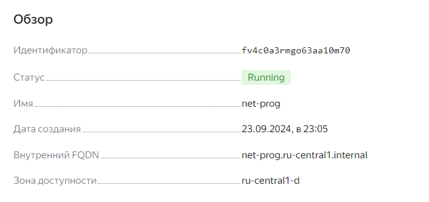


Проверим, что все хорошо и нам не нужно обновляться.

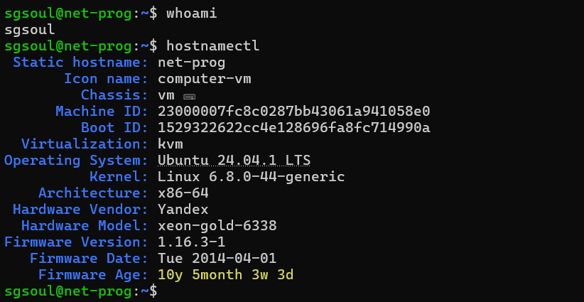


Теперь необходимо убедиться, что python3 и Ansible установлены.

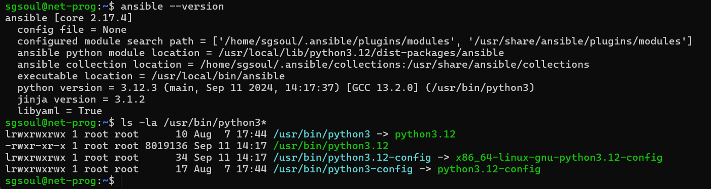

</details>

---

<details>
<summary>Устанавлаиваем CHR (RouterOS) на VirtualBox </summary>

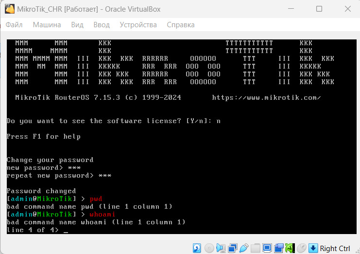

Узнаем айпи адрес нашешо CHR.

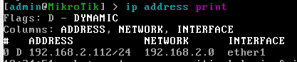

И подключаемся к нему через терминал.

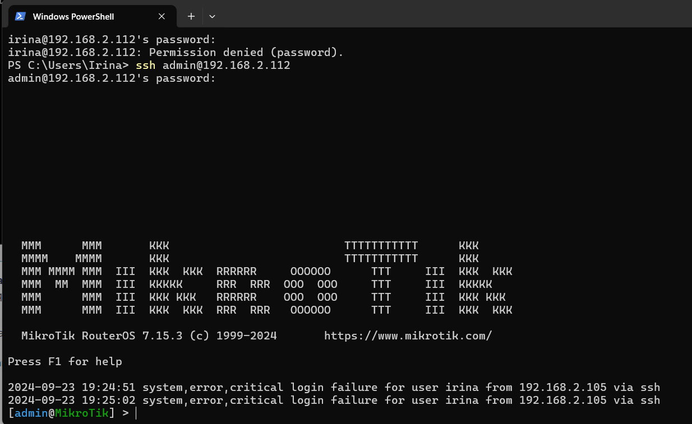

</details>

---

После этого  необходимо создать свой Wireguard сервер для организации VPN туннеля между сервером автоматизации где был установлена система контроля конфигураций Ansible и  локальным CHR.

```bash
sudo apt update
sudo apt install wireguard iptables
```

Генерируем ключи.

```bash
umask 077
wg genkey | tee private.key | wg pubkey > public.key
sudo mv private.key /etc/wireguard/private.key
sudo mv public.key /etc/wireguard/public.key
```
Выводим их значения для дальнейшей работы. 

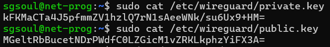

Для настройки сервера нужно создать конфигурационный файл в `/etc/wireguard/wg0.conf` и добавить следующее содержимое:

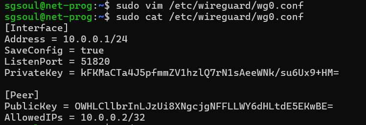

> Тут публичный ключ пира будет заменен после настройки клиента.

Необходимо разрешить IP-преобразование, чтобы пакеты могли передаваться между клиентами и интернетом.

```bash
echo 'net.ipv4.ip_forward=1' | sudo tee /etc/sysctl.d/99-sysctl.conf
sudo sysctl -p
```

Запуск сервера WireGuard.

```bash
wg-quick up wg0
sudo systemctl enable wg-quick@wg0
sudo systemctl status wg-quick@wg0
```

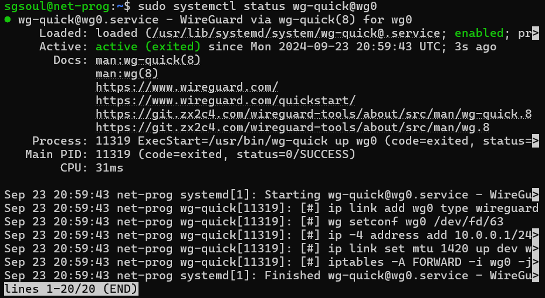


Теперь необходимо будет поднять VPN туннель между VPN сервером на Ubuntu 18 и VPN клиентом на RouterOS (CHR).

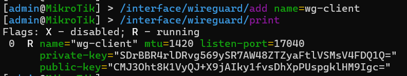 

> Публичный ключ нужно будет добавить в конфигурацию сервера (!)

```RouterOS
/ip/address/add address=10.0.0.2/24 interface=wg1
```

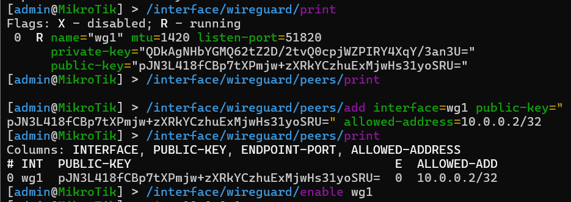 

Финальные настройки будут следующими:


### Результаты лабораторной работы

Проверим доступ клиента с сервера.


И доступ сервера и интернета с клиента.


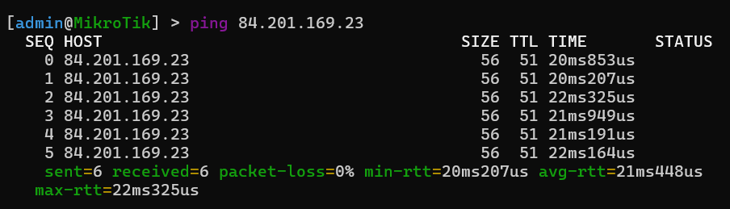


### Вывод
В ходе данной работы были развернуты виртуальная машина на базе платформы Yandex Cloud с установленной системой контроля конфигураций Ansible и CHR в VirtualBox с последующей настройкой WireGuard туннеля.
