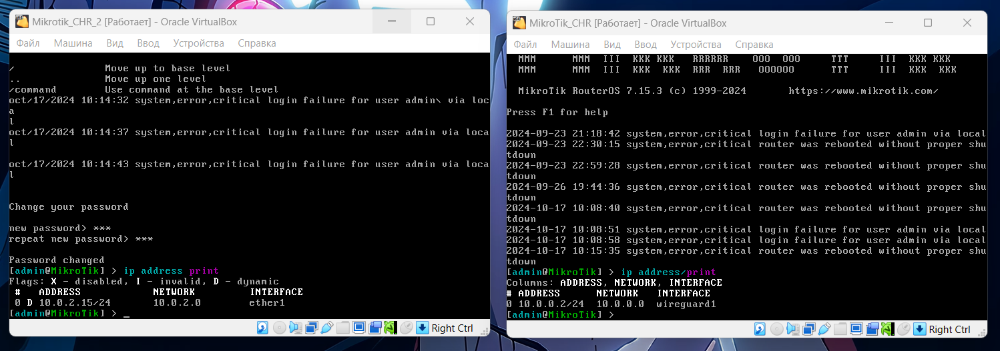
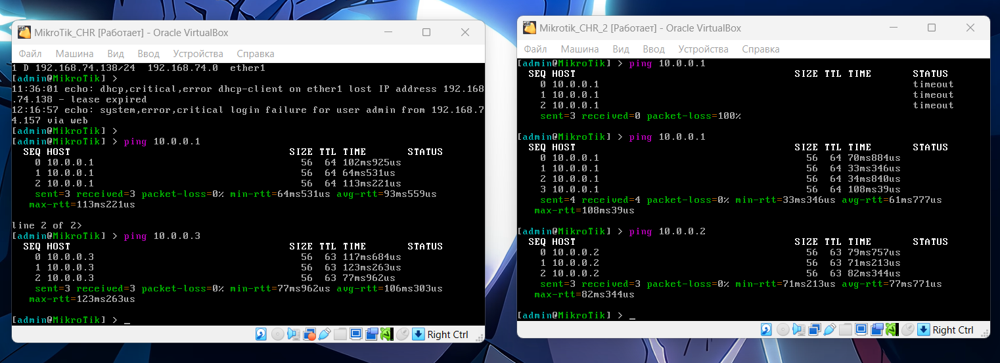
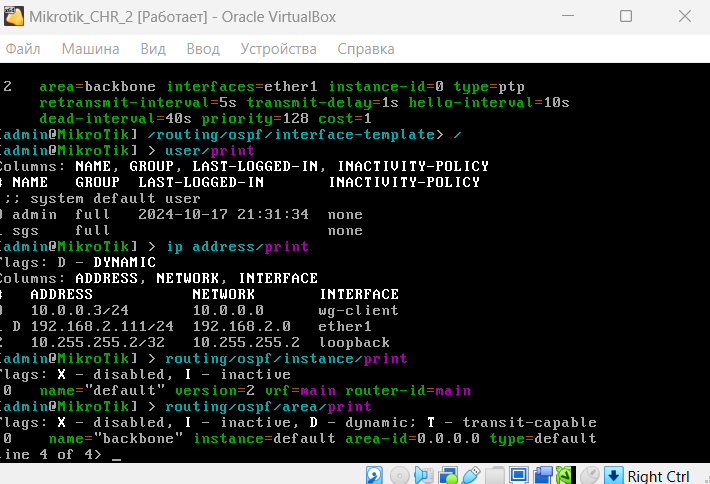

University: [ITMO University](https://itmo.ru/ru/)  
Faculty: [FICT](https://fict.itmo.ru)  
Course: [Network programming](https://github.com/itmo-ict-faculty/network-programming)  
Year: 2024/2025  
Group: K34202  
Author: Loskutova Irina  
Lab: Lab1  
Date of create: 17.10.2024  
Date of finished: 

## Лабораторная работа №1 "Развертывание дополнительного CHR, первый сценарий Ansible"

### Описание
В данной лабораторной работе вы на практике ознакомитесь с системой управления конфигурацией Ansible, использующаяся для автоматизации настройки и развертывания программного обеспечения.
### Цель работы
С помощью Ansible настроить несколько сетевых устройств и собрать информацию о них. Правильно собрать файл Inventory.
### Ход работы

Установим второй CHR на своем ПК.



Организуем второй WireGuard Client на втором CHR и проверим доступ до сервера `10.0.0.1` и между клиентами `10.0.0.2` `10.0.0.3`



Используя Ansible, настроим сразу на 2-х CHR:
- логин/пароль
- NTP Client
- OSPF с указанием Router ID
- Соберем данные по OSPF топологии и полный конфиг устройства

Конфигурация получилась следующей:
```bash
sgsoul@cloud-systems-and-services:~/net-prog$ cat inventory/hosts
[chr_routers]
chr1 ansible_host=10.0.0.2 ansible_user=admin
chr2 ansible_host=10.0.0.3 ansible_user=admin


[chr_routers:vars]
ansible_connection=ansible.netcommon.network_cli
ansible_network_os=community.routeros.routeros
ansible_ssh_private_key_file==/home/sgsoul/net-prog/id-rsa

sgsoul@cloud-systems-and-services:~/net-prog$ cat ansible.cfg
[defaults]
inventory = ./inventory/hosts
host_key_checking = False
ansible_remote_tmp = /tmp
```

А плейбук таким:
```bash
sgsoul@cloud-systems-and-services:~/net-prog$ cat chrs.yml
---
- name: Setup MikroTik CHR
  hosts: chr_routers
  gather_facts: no
  tasks:
    - name: Set new login credentials
      community.routeros.command:
        commands:
          - /user add name=sgs password=999 group=full

    - name: Configure NTP Client
      community.routeros.command:
        commands:
          - /system ntp client set enabled=yes mode=unicast
          - /system ntp client servers add address=0.ru.pool.ntp.org
    - name: Setup OSPF
      community.routeros.command:
        commands:
          - /routing ospf instance add name=default
          - /interface bridge add name=loopback
          - /ip address add address={{router_ospf_ip}} interface=loopback
          - /routing ospf instance set 0 router-id={{router_ospf_ip}}
          - /routing ospf area add instance=default name=backbone
          - /routing ospf interface-template add area=backbone interfaces=ether1 type=ptp
      vars:
        router_ospf_ip: "{{ '10.255.255.1/32' if ansible_host == '10.0.0.2' else '10.255.255.2/32' }}"
    - name: Get config
      community.routeros.command:
        commands:
          - /export
      register: config

    - name: Print config
      debug:
        var: config.stdout_lines
```

Запустим и проверим, что все супер:

```bash
sgsoul@cloud-systems-and-services:~/net-prog$ ansible-playbook chrs.yml

PLAY [Setup MikroTik CHR] **********************************************************************************************************************************

TASK [Set new login credentials] ***************************************************************************************************************************
[WARNING]: ansible-pylibssh not installed, falling back to paramiko
changed: [chr1]
changed: [chr2]

TASK [Configure NTP Client] ********************************************************************************************************************************
changed: [chr1]
changed: [chr2]

TASK [Setup OSPF] ******************************************************************************************************************************************
changed: [chr1]
changed: [chr2]

TASK [Get config] ******************************************************************************************************************************************
changed: [chr2]
changed: [chr1]

TASK [Print config] ****************************************************************************************************************************************
ok: [chr1] => {
    "config.stdout_lines": [
        [
            "# 2024-10-17 21:31:50 by RouterOS 7.15.3",
            "# software id = ",
            "#",
            "/disk",
            "set slot1 media-interface=none media-sharing=no slot=slot1",
            "set slot2 media-interface=none media-sharing=no slot=slot2",
            "set slot3 media-interface=none media-sharing=no slot=slot3",
            "set slot4 media-interface=none media-sharing=no slot=slot4",
            "set slot5 media-interface=none media-sharing=no slot=slot5",
            "/interface bridge",
            "add name=loopback",
            "/interface wireguard",
            "add listen-port=51820 mtu=1420 name=wireguard1",
            "/routing ospf instance",
            "add disabled=no name=default",
            "/routing ospf area",
            "add disabled=no instance=default name=backbone",
            "/interface wireguard peers",
            "add allowed-address=10.0.0.0/24 endpoint-address=84.252.133.81 endpoint-port=\\",
            "    51820 interface=wireguard1 name=p1 persistent-keepalive=25s public-key=\\",
            "    \"DRa2BqfdKLQ3t6r/gBp0NSGXeN0JcL14ytJAjT20NWY=\"",
            "/ip address",
            "add address=10.0.0.2/24 interface=wireguard1 network=10.0.0.0",
            "add address=10.255.255.1 interface=loopback network=10.255.255.1",
            "/ip dhcp-client",
            "add interface=ether1",
            "/ip firewall filter",
            "add action=accept chain=input dst-port=51820 protocol=udp",
            "add action=accept chain=forward in-interface=wireguard1 out-interface=\\",
            "    wireguard1",
            "/ip firewall nat",
            "add action=masquerade chain=srcnat",
            "/ip route",
            "add dst-address=0.0.0.0/0 gateway=*4",
            "/ip ssh",
            "set always-allow-password-login=yes forwarding-enabled=both",
            "/routing ospf interface-template",
            "add area=backbone disabled=no interfaces=ether1 type=ptp",
            "add area=backbone disabled=no interfaces=ether1 type=ptp",
            "add area=backbone disabled=no interfaces=ether1 type=ptp",
            "/system note",
            "set show-at-login=no",
            "/system ntp client",
            "set enabled=yes",
            "/system ntp client servers",
            "add address=0.ru.pool.ntp.org"
        ]
    ]
}
ok: [chr2] => {
    "config.stdout_lines": [
        [
            "# 2024-10-17 21:31:50 by RouterOS 7.16.1",
            "# software id = ",
            "#",
            "/interface bridge",
            "add name=loopback",
            "/interface wireguard",
            "add listen-port=51820 mtu=1420 name=wg-client",
            "/routing ospf instance",
            "add disabled=no name=default",
            "/routing ospf area",
            "add disabled=no instance=default name=backbone",
            "/interface wireguard peers",
            "add allowed-address=10.0.0.0/24 endpoint-address=84.252.133.81 endpoint-port=\\",
            "    51820 interface=wg-client name=p2 persistent-keepalive=25s public-key=\\",
            "    \"DRa2BqfdKLQ3t6r/gBp0NSGXeN0JcL14ytJAjT20NWY=\"",
            "/ip address",
            "add address=10.0.0.3/24 interface=wg-client network=10.0.0.0",
            "add address=10.255.255.2 interface=loopback network=10.255.255.2",
            "/ip dhcp-client",
            "add interface=ether1",
            "/ip firewall filter",
            "add action=accept chain=input dst-port=51820 protocol=udp",
            "add action=accept chain=forward in-interface=wg-client out-interface=\\",
            "    wg-client",
            "/ip firewall nat",
            "add action=masquerade chain=srcnat",
            "/ip ssh",
            "set always-allow-password-login=yes forwarding-enabled=both",
            "/routing ospf interface-template",
            "add area=backbone disabled=no interfaces=ether1 type=ptp",
            "add area=backbone disabled=no interfaces=ether1 type=ptp",
            "add area=backbone disabled=no interfaces=ether1 type=ptp",
            "/system note",
            "set show-at-login=no",
            "/system ntp client",
            "set enabled=yes",
            "/system ntp client servers",
            "add address=0.ru.pool.ntp.org"
        ]
    ]
}

PLAY RECAP *************************************************************************************************************************************************
chr1                       : ok=5    changed=4    unreachable=0    failed=0    skipped=0    rescued=0    ignored=0
chr2                       : ok=5    changed=4    unreachable=0    failed=0    skipped=0    rescued=0    ignored=0

sgsoul@cloud-systems-and-services:~/net-prog$
```
Сверим, что полученные конфигурации корректны:



### Вывод
В ходе данной работы с попомщью Ansible были настроены несколько сетевых устройств и собрана информация о них.