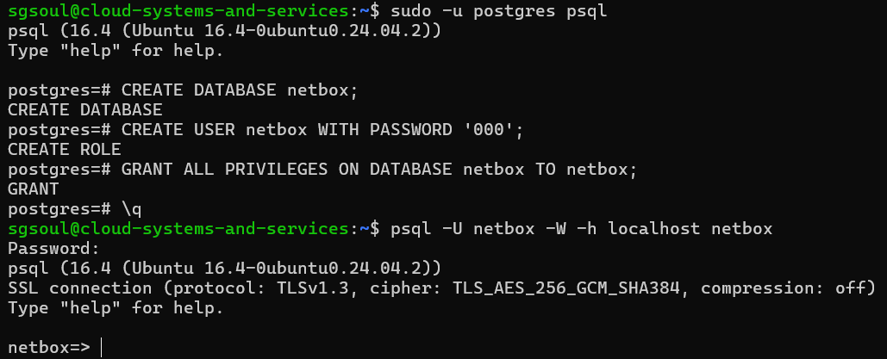
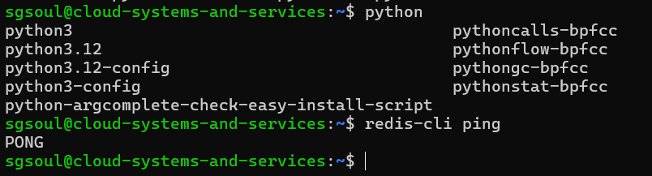

University: [ITMO University](https://itmo.ru/ru/)  
Faculty: [FICT](https://fict.itmo.ru)  
Course: [Network programming](https://github.com/itmo-ict-faculty/network-programming)  
Year: 2024/2025  
Group: K34202  
Author: Loskutova Irina  
Lab: Lab1  
Date of create: 11.11.2024  
Date of finished: 12.11.2024

## Лабораторная работа №3 "Развертывание Netbox, сеть связи как источник правды в системе технического учета Netbox"

### Описание
В данной лабораторной работе вы ознакомитесь с интеграцией Ansible и Netbox и изучите методы сбора информации с помощью данной интеграции.

### Цель работы
С помощью Ansible и Netbox собрать всю возможную информацию об устройствах и сохранить их в отдельном файле.
### Ход работы

##### Установим NetBox.

1. Для этого установим необходимые компоненты:

1.1 posgtres



1.2 python modules

1.3 redis



2. Выполним миграции:


> Параллельно наслажадемся жизнью =)


3. Запускаем NetBox и логинимся:

```bash
(venv) sgsoul@cloud-systems-and-services:/opt/netbox/netbox$ python3 manage.py runserver 0.0.0.0:8000 --insecure
Performing system checks...

System check identified no issues (0 silenced).
November 11, 2024 - 13:13:05
Django version 5.0.9, using settings 'netbox.settings'
Starting development server at http://0.0.0.0:8000/
Quit the server with CONTROL-C.
```


#### Добавим устройства 


#### Используя Ansible и роли для Netbox в тестовом режиме сохраним все данные из Netbox в отдельный файл

<details>
<summary>Напишем роль для экспорта данных.</summary>

```bash
sgsoul@cloud-systems-and-services:~/net-prog$ cat inventory/NB_inventory.ini
[netbox]
localhost

[netbox:vars]
ansible_user=admin
ansible_password=000
ansible_become=true
sgsoul@cloud-systems-and-services:~/net-prog$ cat roles/nb_export/tasks/main.yml
---
- name: Export devices from NetBox
  uri:
    url: "{{ netbox_api_url }}dcim/devices/"
    method: GET
    headers:
      Authorization: "Token {{ netbox_token }}"
    return_content: yes
  register: devices_data

- name: Save devices data to file
  copy:
    content: "{{ devices_data.content }}"
    dest: "/tmp/netbox_devices_data.json"

- name: Export IP addresses from NetBox
  uri:
    url: "{{ netbox_api_url }}ipam/ip-addresses/"
    method: GET
    headers:
      Authorization: "Token {{ netbox_token }}"
    return_content: yes
  register: ip_addresses_data

- name: Save IP addresses data to file
  copy:
    content: "{{ ip_addresses_data.content }}"
    dest: "/tmp/netbox_ip_addresses_data.json"

- name: Export interfaces from NetBox
  uri:
    url: "{{ netbox_api_url }}dcim/interfaces/"
    method: GET
    headers:
      Authorization: "Token {{ netbox_token }}"
    return_content: yes
  register: interfaces_data

- name: Save interfaces data to file
  copy:
    content: "{{ interfaces_data.content }}"
    dest: "/tmp/netbox_interfaces_data.json"
sgsoul@cloud-systems-and-services:~/net-prog$ cat NB_data_export.yml
---
- name: Export data from NetBox to files
  hosts: localhost
  gather_facts: no
  roles:
    - nb_export
sgsoul@cloud-systems-and-services:~/net-prog$
```
</details>


Проверим, что всё собралось:


#### Напишем плейбук, при котором на основе данных из Netbox можно настроить 2 CHR, изменить имя устройства, добавить IP адрес на устройство


<details>
<summary>Напишем плейбук для конфигурации CHR.</summary>

```bash
sgsoul@cloud-systems-and-services:~/net-prog$ cat configure_chrs.yml
---
- name: Configure CHRs based on NetBox data
  hosts: chr_routers
  gather_facts: no
  vars:
    netbox_url: "http://130.193.46.184:8000/api/"
    netbox_api_token: "ee977aaf25643c2d24bfb491d7b1a2851447bc02"

  tasks:
    - name: Fetch device data from NetBox
      uri:
        url: "{{ netbox_url }}/api/dcim/devices/?name={{ ansible_host }}"
        method: GET
        headers:
          Authorization: "Token {{ netbox_api_token }}"
        return_content: yes
      register: netbox_device_data

    - name: Check if device data was found in NetBox
      fail:
        msg: "Device not found in NetBox for {{ ansible_host }}"
      when: netbox_device_data.json.results | length == 0

    - name: Set IP address and interface from NetBox data
      set_fact:
        netbox_ip_address: "{{ netbox_device_data.json.results[0].primary_ip.address }}"
        netbox_interface: "{{ netbox_device_data.json.results[0].primary_ip.interface.name }}"

    - name: Set device hostname on CHR
      community.routeros.command:
        commands:
          - /system identity set name={{ ansible_host }}
      register: hostname_result

    - name: Show hostname change result
      debug:
        var: hostname_result

    - name: Add IP address to CHR
      community.routeros.command:
        commands:
          - /ip address add address={{ netbox_ip_address }} interface={{ netbox_interface }}
      register: ip_address_result

    - name: Show IP address addition result
      debug:
        var: ip_address_result
sgsoul@cloud-systems-and-services:~/net-prog$
```
</details>

Проверим, что всё отработало:


#### Напишем плейбук, позволяющий собрать серийный номер устройства и вносящий серийный номер в Netbox

<details>
<summary>Напишем плейбук для настройки серийного номера.</summary>
  
```bash
sgsoul@cloud-systems-and-services:~/net-prog$ cat serial_num.yml
---
- name: Collect and update serial number in NetBox
  hosts: chr_routers
  gather_facts: no
  vars:
    netbox_url: "http://130.193.46.184:8000/api/"
    netbox_api_token: "ee977aaf25643c2d24bfb491d7b1a2851447bc02"

  tasks:
    - name: Gather serial number from the device
      community.routeros.command:
        commands:
          - /system license print
      register: serial_output

    - name: Verify that serial number was gathered
      fail:
        msg: "Could not find serial number"
      when: serial_number is not defined or serial_number == ""

    - name: Fetch device ID from NetBox
      uri:
        url: "{{ netbox_url }}/api/dcim/devices/?name={{ inventory_hostname }}"
        method: GET
        headers:
          Authorization: "Token {{ netbox_api_token }}"
        validate_certs: no
        return_content: yes
      register: netbox_device_data
      failed_when: "'results' not in netbox_device_data.json or netbox_device_data.json.results | length == 0"

    - name: Extract device ID from NetBox response
      set_fact:
        device_id: "{{ netbox_device_data.json.results[0].id }}"

    - name: Update serial number in NetBox
      uri:
        url: "{{ netbox_url }}/api/dcim/devices/{{ device_id }}/"
        method: PATCH
        headers:
          Authorization: "Token {{ netbox_api_token }}"
          Content-Type: "application/json"
        body: "{{ {'serial': serial_number} | to_json }}"
        status_code: 200
        validate_certs: no
      register: update_response

    - name: Check if serial number update was successful
      debug:
        msg: "Serial number for {{ inventory_hostname }} updated to {{ serial_number }} in NetBox"
      when: update_response.status == 200
sgsoul@cloud-systems-and-services:~/net-prog$
```
</details>

Проверим, что всё прошло успешно:


### Вывод
В ходе данной работы с попомщью Ansible и Netbox была собрана вся возможная информация об устройствах. 
