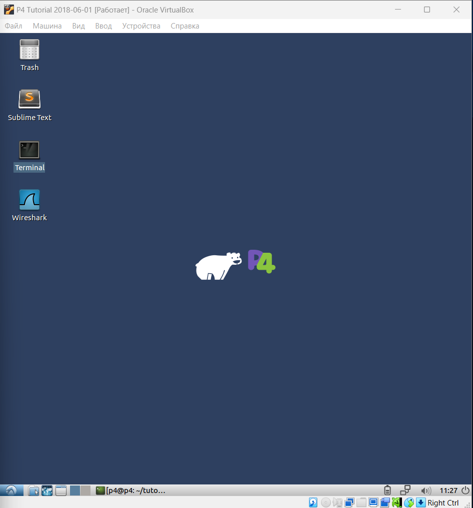
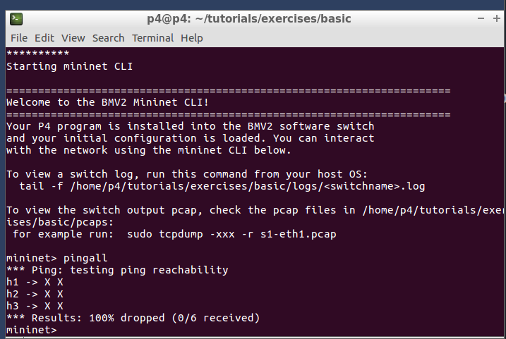
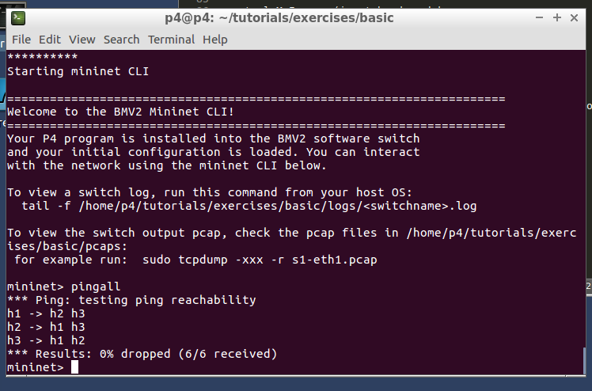
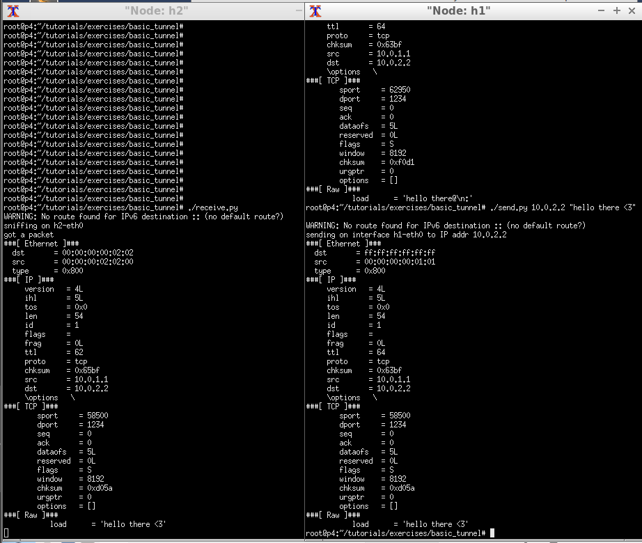
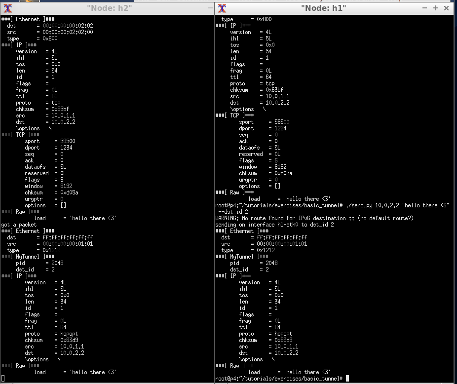
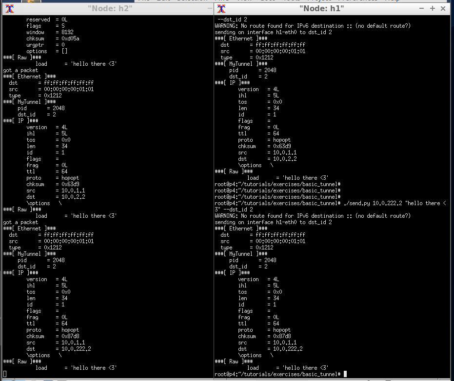

University: [ITMO University](https://itmo.ru/ru/)  
Faculty: [FICT](https://fict.itmo.ru)  
Course: [Network programming](https://github.com/itmo-ict-faculty/network-programming)  
Year: 2024/2025  
Group: K34202  
Author: Loskutova Irina  
Lab: Lab1  
Date of create: 05.12.2024  
Date of finished: 06.12.2024

## Лабораторная работа №4 "Базовая 'коммутация' и туннелирование используя язык программирования P4"

### Описание
В данной лабораторной работе вы познакомитесь на практике с языком программирования P4, разработанный компанией Barefoot (ныне Intel) для организации процесса обработки сетевого трафика на скорости чипа. Barefoot разработал несколько FPGA чипов для обработки трафика которые были встроенны в некоторые модели коммутаторов Arista и Brocade.

### Цель работы
Изучить синтаксис языка программирования P4 и выполнить 2 задания обучающих задания от Open network foundation для ознакомления на практике с P4.

---

### Ход работы

## Поднятие виртуальной машины 

1. Скачиваем шаблон конфигурации `P4 Tutorial` (https://p4.org/p4_events/p4-developer-day-2/)
2. В VirtualBox через импорт конфигурации создаеам ВМ 
3. Запускаем нашу ВМ и смтортим, что все хорошо:



## Реализация базовой переадресации

1. Проверим, что изначально пинг не поддреживается. Для этого поднимем `mininet`

```bash
make run
```



2. В файле `basic.p4` внесем необходимые изменения:

+ В разделе Parsers добавлен парсинг `ethernet` и `ipv4 headers`.

```c
/*************************************************************************
*********************** P A R S E R  ***********************************
*************************************************************************/

parser MyParser(packet_in packet,
                out headers hdr,
                inout metadata meta,
                inout standard_metadata_t standard_metadata) {

    state start {
        transition parse_ethernet;
    }

    state parse_ethernet {
        packet.extract(hdr.ethernet);
        transition select(hdr.ethernet.etherType) {
            TYPE_IPV4 : parse_ipv4;
            default : accept;
        }
    }

    state parse_ipv4 {
        packet.extract(hdr.ipv4);
        transition accept;
    }
}
```

+ В разделе Ingress processing добавлен метод, отвечающий за пересылки пакетов + условие проверки `ipv4 headers`.

```c
/*************************************************************************
**************  I N G R E S S   P R O C E S S I N G   *******************
*************************************************************************/

control MyIngress(inout headers hdr,
                  inout metadata meta,
                  inout standard_metadata_t standard_metadata) {
    action drop() {
        mark_to_drop(standard_metadata);
    }

    action ipv4_forward(macAddr_t dstAddr, egressSpec_t port) {
        standard_metadata.egress_spec = port;
        hdr.ethernet.srcAddr = hdr.ethernet.dstAddr;
        hdr.ethernet.dstAddr = dstAddr;
        hdr.ipv4.ttl = hdr.ipv4.ttl - 1;
    }

    table ipv4_lpm {
        key = {
            hdr.ipv4.dstAddr: lpm;
        }
        actions = {
            ipv4_forward;
            drop;
            NoAction;
        }
        size = 1024;
        default_action = NoAction();
    }

    apply {
        if (hdr.ipv4.isValid()) {
            ipv4_lpm.apply();
        }
    }
}
```

+ В разделе Deparsers добавлен депарсинг `ethernet` и `ipv4 headers`.

```c
/*************************************************************************
***********************  D E P A R S E R  *******************************
*************************************************************************/

control MyDeparser(packet_out packet, in headers hdr) {
    apply {
        packet.emit(hdr.ethernet);
        packet.emit(hdr.ipv4);
    }
}
```

3. Переподнимем `mininet` и проверим, что пинг идет у всех коммутаторов.



## Реализация базового туннелирования

1. В файле `basic_tunnel.p4` внесем необходимые изменения:

+ Для теннелирования необходима константа `bit<16> TYPE_MYTUNNEL = 0x1212`

+ Также проверим заголовок `header myTunnel_t `, который включает id протокола и коммутатора приема.

```c
const bit<16> TYPE_MYTUNNEL = 0x1212;
const bit<16> TYPE_IPV4 = 0x800;

/*************************************************************************
*********************** H E A D E R S  ***********************************
*************************************************************************/

typedef bit<9>  egressSpec_t;
typedef bit<48> macAddr_t;
typedef bit<32> ip4Addr_t;

header ethernet_t {
    macAddr_t dstAddr;
    macAddr_t srcAddr;
    bit<16>   etherType;
}

header myTunnel_t {
    bit<16> proto_id;
    bit<16> dst_id;
}

header ipv4_t {
    bit<4>    version;
    bit<4>    ihl;
    bit<8>    diffserv;
    bit<16>   totalLen;
    bit<16>   identification;
    bit<3>    flags;
    bit<13>   fragOffset;
    bit<8>    ttl;
    bit<8>    protocol;
    bit<16>   hdrChecksum;
    ip4Addr_t srcAddr;
    ip4Addr_t dstAddr;
}

struct metadata {
    /* empty */
}

struct headers {
    ethernet_t   ethernet;
    myTunnel_t   myTunnel;
    ipv4_t       ipv4;
}
```

+ В разделе Parsers добавлено состояние `state parse_myTunnel` + добавлено в оператор select в `state parse_ethernet`. 
```c
/*************************************************************************
*********************** P A R S E R  ***********************************
*************************************************************************/

parser MyParser(packet_in packet,
                out headers hdr,
                inout metadata meta,
                inout standard_metadata_t standard_metadata) {

    state start {
        transition parse_ethernet;
    }

    state parse_ethernet {
        packet.extract(hdr.ethernet);
        transition select(hdr.ethernet.etherType) {
            TYPE_IPV4 : parse_ipv4;
            TYPE_MYTUNNEL : parse_myTunnel;
            default : accept;
        }
    }

    state parse_ipv4 {
        packet.extract(hdr.ipv4);
        transition accept;
    }
    
    state parse_myTunnel {
        packet.extract(hdr.myTunnel);
        transition select(hdr.myTunnel.proto_id) {
            TYPE_IPV4 : parse_ipv4;
            default : accept;    
        }
    }

}
```

+ В разделе Ingress processing добавлено новое действие `action myTunnel_forward(egressSpec_t port)`, а также новая таблица `table myTunnel_exact`, дополнительно прописано условие проверки: если ip задан верно, а туннель нет, то отправляем пакеты без туннеля, если все корректно, то используем туннель.

```c
/*************************************************************************
**************  I N G R E S S   P R O C E S S I N G   *******************
*************************************************************************/

control MyIngress(inout headers hdr,
                  inout metadata meta,
                  inout standard_metadata_t standard_metadata) {
    action drop() {
        mark_to_drop(standard_metadata);
    }

    action ipv4_forward(macAddr_t dstAddr, egressSpec_t port) {
        standard_metadata.egress_spec = port;
        hdr.ethernet.srcAddr = hdr.ethernet.dstAddr;
        hdr.ethernet.dstAddr = dstAddr;
        hdr.ipv4.ttl = hdr.ipv4.ttl - 1;
    }


    table ipv4_lpm {
        key = {
            hdr.ipv4.dstAddr: lpm;
        }
        actions = {
            ipv4_forward;
            drop;
            NoAction;
        }
        size = 1024;
        default_action = drop();
    }

    action myTunnel_forward(egressSpec_t port) {
        standard_metadata.egress_spec = port;
    }

    table myTunnel_exact {
        key = {
            hdr.myTunnel.dst_id: exact;
        }
        actions = {
            myTunnel_forward;
            drop;
            NoAction;
        }
        size = 1024;
        default_action = NoAction();
    }

    apply {
        if (hdr.ipv4.isValid() && !hdr.myTunnel.isValid()) {
            ipv4_lpm.apply();
        }
        if (hdr.myTunnel.isValid()) {
            myTunnel_exact.apply();
        }
    }
}
```

+ В разделе Deparsers добавлено преобразование пакетов туннелирования.

```c
/*************************************************************************
***********************  D E P A R S E R  *******************************
*************************************************************************/

control MyDeparser(packet_out packet, in headers hdr) {
    apply {
        packet.emit(hdr.ethernet);
        packet.emit(hdr.myTunnel);
        packet.emit(hdr.ipv4);
    }
}
```

2. Проверим корректность работы без туннелирования `./send.py 10.0.2.2 "message"`



3. Теперь проверим работу с туннелированием `./send.py 10.0.2.2 "message" --dst_id 2`



4. И наконец проверим работу проверки IP `./send.py 10.0.222.2 "message" --dst_id 2`



### Вывод
В ходе данной работы были реализованы базовая переадресация и туннелирование с помощью языка P4
